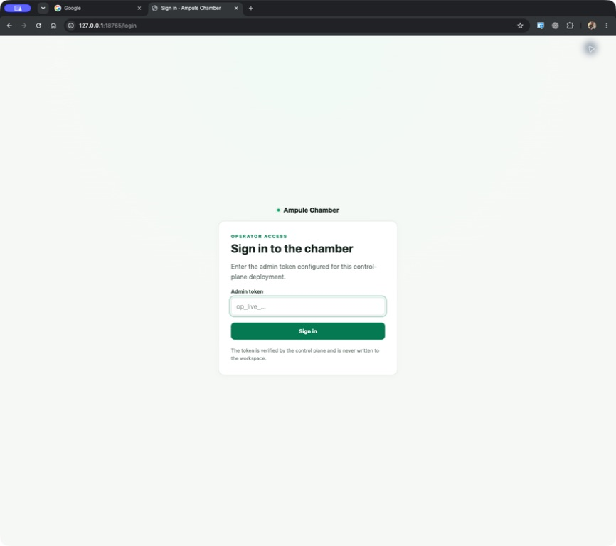
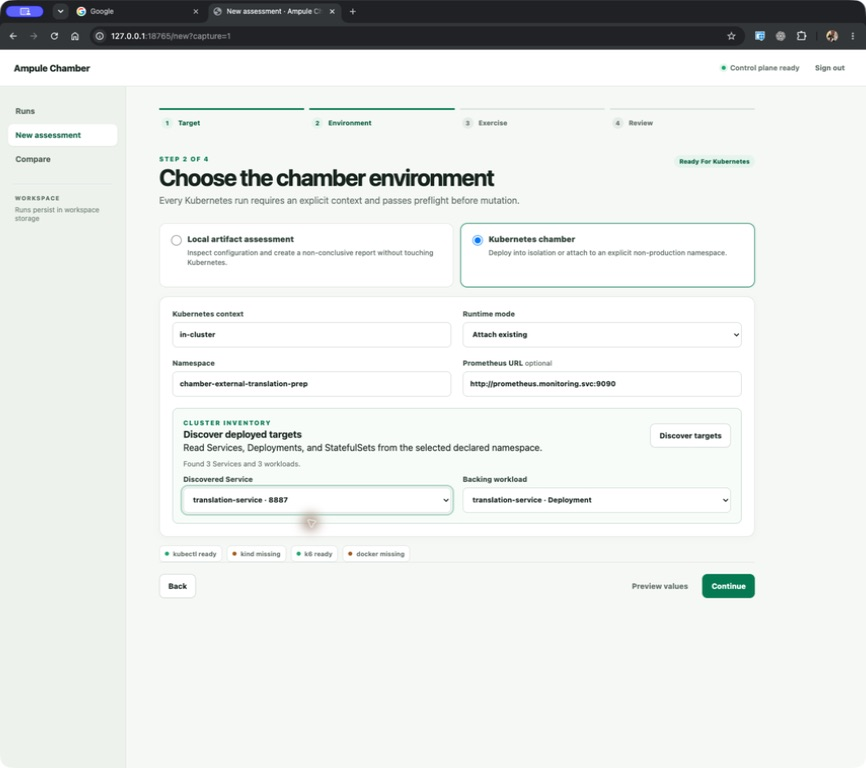
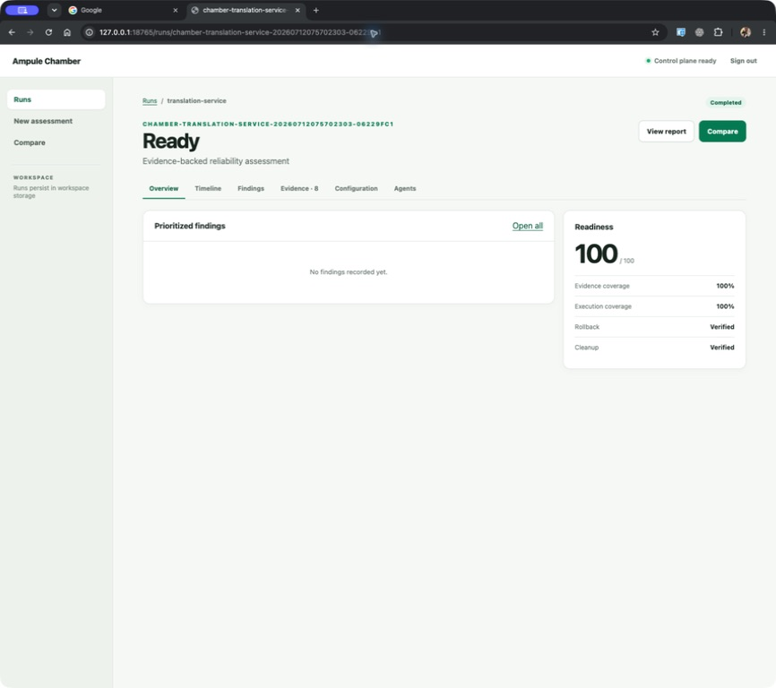

# Control Plane UI

The control plane is a server-rendered interface over the same
application services and safety checks used by the CLI. It does not introduce a
second execution engine.

## Start locally

```bash
uv sync --extra ui
uv run ampule-chamber ui
```

The default address is `http://127.0.0.1:8765`. Use `--no-open` to suppress
browser launch or `--workspace <path>` to select another run store. Binding to a
non-loopback host is rejected unless `--allow-remote` is explicitly supplied
and `AMPULE_CHAMBER_ADMIN_TOKEN` contains a valid `op_live_` operator token.

## Deploy in Kubernetes

The supported in-cluster layout uses one control-plane replica, a ServiceAccount,
namespace-scoped RBAC, a ClusterIP Service, and a PVC-backed workspace. The UI
uses its pod identity and an in-cluster kubeconfig; it does not require a source
repository to discover and attach to existing Services.

Generate an operator token and install the Helm chart. Only declare reviewed,
non-production target namespaces:

```bash
export AMPULE_ADMIN_TOKEN="op_live_$(openssl rand -hex 24)"

helm upgrade --install ampule deploy/helm/ampule-chamber \
  --namespace ampule-system \
  --create-namespace \
  --set-string auth.adminToken="$AMPULE_ADMIN_TOKEN" \
  --set 'discovery.namespaces[0]=chamber-target'
```

For production GitOps, create the Secret separately and avoid putting the token
in Helm release values:

```bash
kubectl create namespace ampule-system
kubectl -n ampule-system create secret generic ampule-auth \
  --from-literal=admin-token="$AMPULE_ADMIN_TOKEN"

helm upgrade --install ampule deploy/helm/ampule-chamber \
  --namespace ampule-system \
  --set auth.existingSecret=ampule-auth \
  --set 'discovery.namespaces[0]=chamber-target'
```

The token must start with `op_live_` and contain at least 24 characters. The
server keeps only its SHA-256 digest and issues an HttpOnly session cookie after
sign-in. The same token is accepted as `Authorization: Bearer` for API clients.



### Open the UI

For operator-only access, use port-forwarding:

```bash
kubectl -n ampule-system port-forward service/ampule-ampule-chamber 8765:8765
```

Then open `http://127.0.0.1:8765` and enter the operator token. For an Ingress,
set `ingress.enabled=true`, configure `ingress.className`, `ingress.host`, and
`ingress.tls`, and set `auth.secureCookies=true`. Terminate TLS at the Ingress
and restrict the route to trusted operator networks or an identity-aware proxy.

### Discover existing services

Every entry in `discovery.namespaces` creates read-focused Role and RoleBinding
resources in that existing namespace. The discovery API lists Services,
Deployments, and StatefulSets only there, and matches a Service to its backing
workload by selector. Operators may still type a Service or workload name when
automatic matching is not possible.



The default RBAC can read workloads, endpoints, events, logs, and pod metrics,
and create the pod port-forward subresource needed by traffic execution. It
cannot delete pods or scale workloads. Set `rbac.allowFaults=true` only when
controlled attach-mode faults are intended and the target workloads carry the
Chamber allow-list label or annotation.

### Storage and upgrades

The PVC stores `runs.db`, plans, run metadata, logs, evidence, reports, exports,
and user-created scenarios under `/data/.chamber`. The Deployment deliberately uses one replica
and a `Recreate` strategy because the current job manager is in-memory and the
SQLite index is PVC-backed. Configure `persistence.storageClass`,
`persistence.size`, or `persistence.existingClaim` to fit the cluster. Database
support and horizontal replicas are deferred to a later phase. Helm keeps a
chart-created claim on uninstall by default; set `persistence.retain=false`
only when uninstalling should also delete the claim.

The raw alternative is `deploy/kubernetes/ampule-chamber.yaml`. Replace the
placeholder admin token and every `chamber-target` namespace before applying:

```bash
kubectl apply -f deploy/kubernetes/ampule-chamber.yaml
```

Prefer Helm when several namespaces, an existing Secret or PVC, an Ingress, or
custom security/resource settings are needed.

## Core journey

1. **Target:** choose a local repository, or select a running Kubernetes
   service and provide the Service plus its backing Deployment or StatefulSet
   without a repository. Service and workload names are kept separate.
2. **Environment:** choose a local artifact assessment, isolated Kubernetes
   deploy, or attach to an existing non-production namespace. Live runs require
   an explicit context.
3. **Exercise:** build a custom scenario, select a bundled or workspace
   scenario, or import supported YAML/JSON. Every selection populates the same
   editable fields before review. Add one or more HTTP or Relayna traffic journeys. Each journey
   has its own method, path, expected HTTP status, body, and load model. HTTP
   journeys support reusable profiles, custom stages, or fixed iterations;
   Relayna journeys additionally configure task ID extraction, SSE terminal
   statuses, concurrency, iterations, and completion timeout. One assessment
   cannot mix HTTP and Relayna adapters. Optionally choose an attach-only,
   allow-listed fault.
4. **Review:** inspect the safety receipt and generated plan before any live
   action.
5. **Run:** observe state and evidence updates. Cancellation sends an interrupt
   to the workflow so rollback, cleanup, result persistence, and reporting can
   complete.
6. **Results:** review readiness, coverage, findings, timeline, registered
   evidence, resolved configuration, and agent output. Compare compatible runs
   or export HTML, Markdown, or JSON.

### Runtime evidence in the assessment UI

The Evidence tab turns `prometheus-memory.json` into per-pod cards for memory,
CPU, restarts, and sample coverage. New attach assessments query the complete
traffic window, so short-lived Relayna Job pods remain visible beside the API
pod after they exit. Older point-in-time artifacts remain readable, but display
CPU as unavailable because a cumulative CPU counter cannot be converted safely
to a rate without a time range.

Relayna assessments also show a separate feed card for every admitted task.
Each card is keyed by the task ID returned from that submission and contains
only the bounded, content-safe operational fields retained from its configured
`/events/{task_id}` stream. Concurrent VUs therefore accumulate into separate
task feeds instead of one shared stream.

Worker pods are discovered by Job ownership, run-window start time, and service
labels. When a worker exposes a task-ID label, the UI shows the exact task link.
When it does not, the UI explicitly labels the worker as correlated to the run
rather than claiming an unsupported task-level mapping.

## Exercise editor reference

The Exercise step writes directly to the generated `ChamberConfig`. Settings
above the journey list apply to the whole assessment; each Traffic journey card
becomes one entry in `traffic.journeys`. Use **Add traffic** to add another
journey. Journeys execute sequentially and retain separate k6 tags, request
configuration, expected response, and load schedule.

### Scenario source and identity

**Build custom** preserves the original guided workflow. **Select saved
scenario** searches bundled examples and durable workspace scenarios, with
adapter and fault-profile filters plus metadata for journeys, maximum VUs,
duration, faults, signals, tags, and revision. **Import scenario** accepts YAML
or JSON as either the existing `Scenario` contract or a complete
`ChamberConfig`. See [Scenario Contracts](scenarios.md) for the exact
normalization, validation, storage, and provenance rules.

Selection or import replaces the current journey cards with editable resolved
values. Review the target compatibility warning, paths, bodies, load model,
Relayna lifecycle settings, follow-up checks, required telemetry, and agent
mode. A configured fault remains disabled until it is explicitly chosen in the
fault template field.

Scenario ID, name, description, and comma-separated tags are editable for every
source. Choose **Save as new** to add the resolved full `ChamberConfig` to the
workspace catalog. Replacement is limited to user scenarios and requires the
confirmation checkbox; bundled examples are never overwritten.

The versioned API exposes:

- `GET /api/v1/scenarios` for catalog metadata;
- `GET /api/v1/scenarios/{source}/{id}` for one normalized editable scenario;
- `POST /api/v1/scenarios/validate` for bounded YAML/JSON validation;
- `POST /api/v1/scenarios` for atomic creation or explicitly confirmed
  replacement.

### Assessment settings

**Service port** is the Kubernetes Service port used by `runtime.trafficAccess`
for port-forwarding. Enter the Service's exposed port, which may differ from
the container port:

```yaml
runtime:
  trafficAccess:
    mode: port-forward
    service: translation-service
    servicePort: 8887
```

**Attach fault template** controls the optional fault applied after baseline
traffic:

- **Observe only** performs no fault injection and is the recommended starting
  point for a new target.
- **Kill one pod** terminates one selected pod and observes recovery.
- **Scale deployment to zero** removes availability temporarily and then
  restores the previous replica count.

Attach faults require the target's explicit allow-faults label or annotation.

**Agent mode** controls analysis behavior:

- **Offline deterministic** uses reproducible local logic without OpenAI calls.
- **Disabled** skips agent analysis.
- **Live OpenAI agents** enables configured live analysis agents and requires
  valid OpenAI configuration.

The generated value is stored under `agents.mode`.

One assessment may contain multiple HTTP journeys or multiple Relayna
journeys, but it cannot mix the two adapter types. HTTP journeys run through
k6; Relayna journeys use the stateful task-lifecycle executor.

### Common journey fields

| UI field | ChamberConfig field | Meaning |
| --- | --- | --- |
| Name | `name` | Stable journey identifier used in execution tags and evidence. |
| Adapter | `adapter` | Plain HTTP/k6 or Relayna task lifecycle. HTTP omits the field because it is the default. |
| Method | `method` | HTTP method such as `GET`, `POST`, `PUT`, `PATCH`, or `DELETE`. Relayna requires `POST`. |
| Path | `path` | Absolute endpoint path beginning with `/`, relative to the selected Service. |
| Expected status | `expectedStatus` | Exact HTTP status required for the request check to pass. |
| Tool | `tool` | Traffic tool identifier. Keep `k6` for ordinary HTTP journeys. |
| Request encoding | `requestEncoding` | No body, JSON, multipart form plus file, URL-encoded form, or raw text. |
| Generated text bytes | `textBytes` | Optional size to which the request body's `text` value is repeated and truncated. `0` disables expansion. |
| Request body JSON | `body` | Optional JSON request payload; Relayna requires a non-empty object. |
| Follow-up checks JSON | `followUps` | Optional post-request checks included in onboarding and readiness planning. |

The effective URL is built from the port-forwarded Service address and the
configured path. For example, `/health` is requested through an address such
as `http://127.0.0.1:18080/health`.

`expectedStatus` is an exact comparison. Common values are `200` for a normal
GET, `201` for synchronous resource creation, `202` for accepted asynchronous
work, and `204` for success without a response body. Any other returned status
fails the journey check.

When an HTTP request body contains `task_id`, Chamber adds the VU, iteration,
and timestamp to keep generated task IDs unique. When `textBytes` is greater
than zero and `body.text` exists, Chamber repeats and truncates that text to the
requested size. This is useful for bounded large-request and memory tests.

### Request encodings and file uploads

**No body** sends the request without a payload. This is the normal choice for
health, readiness, and read-only status endpoints.

**JSON** serializes the Request body JSON value and sends
`Content-Type: application/json`. JSON values may contain strings, numbers,
booleans, arrays, nested objects, or `null`; the overall Relayna submission
body must be a non-empty object.

**Multipart form + file** stores browser-selected files in Chamber's workspace.
HTTP journeys generate k6 `http.file` requests; Relayna journeys submit the same
inputs through the stateful task-lifecycle executor. Configure:

- One or more file rows with a unique **Field name**, **Upload**, optional
  filename and content-type overrides, and required/optional state.
- **Multipart form fields JSON** containing scalar strings, integers, and
  booleans. Arrays and objects must use an explicit
  `{"encoding":"json","value":...}` descriptor.
- A 128 MiB per-file and 256 MiB total-request hard limit. Empty files and
  missing or unsupported content types are rejected.

For the `ocr_service` contract inspected on `vm-machine01`, the request is:

```yaml
name: ocr-file-admission
method: POST
path: /ocr
expectedStatus: 202
requestEncoding: multipart
multipart:
  fields:
    engine: internal
    mode: layout
    force_ocr: false
    fallback: docint
    priority: 5
  files:
    - field: file
      path: /durable/chamber/workspace/uploads/<id>/invoice.pdf
      filename: invoice.pdf
      contentType: application/pdf
      required: true
vus: 1
iterations: 1
durationSeconds: 1
```

The OCR service accepts PDF, PNG, JPEG, TIFF, BMP, GIF, and WebP inputs. Its
`file` field is required; `task_id`, `engine`, `mode`, `force_ocr`, `fallback`,
and `priority` are ordinary multipart form fields. The expected admission
response is `202`.

The generated YAML stores durable workspace paths, not the browser's original
local paths. Files must remain readable by the Chamber process when execution
starts. Paths that escape the approved workspace, including symlink escapes,
are rejected. For in-cluster Chamber, keep workspace storage on the configured
PVC.

**URL-encoded form** serializes the Form fields JSON object as
`application/x-www-form-urlencoded`. Use it for APIs that expect ordinary HTML
form submissions without files.

**Raw text** sends the Raw request body without JSON conversion and uses the
configured Content type, such as `text/plain`, `application/xml`, or a custom
media type.

For Relayna, choose **Multipart form + file** and configure task ID extraction,
events path, terminal statuses, success statuses, timeout, VUs, and iterations
in the same journey card. Use **Add file** for a required document plus optional
inputs such as an ROI mask. The Review step displays file count, filename,
content type, and size; it never displays document contents. Lifecycle evidence
and reports persist only field, filename, content type, size, and SHA-256 digest.

### HTTP load models

**Reusable profile** converts the selected profile into explicit k6 stages in
the generated YAML:

| Profile | Generated stages |
| --- | --- |
| Smoke · 1 VU | 15 seconds at 1 VU, then 5 seconds at 0 VUs |
| Baseline · 4 VUs | 30 seconds at 4 VUs, then 30 seconds at 0 VUs |
| Stress · ramp to 25 VUs | 30 seconds at 10 VUs, 60 seconds at 25 VUs, then 30 seconds at 0 VUs |

**Custom stages** accepts a JSON array equivalent to the YAML `stages` field:

```json
[
  {"duration": "15s", "targetVus": 1},
  {"duration": "45s", "targetVus": 3},
  {"duration": "15s", "targetVus": 0}
]
```

Each stage requires a non-empty `duration` and a non-negative integer
`targetVus`. The server rejects malformed stages before creating a plan.

**Fixed iterations** creates a bounded shared-iterations execution:

- **Virtual users** (`vus`) sets maximum concurrency.
- **Iterations** (`iterations`) sets the total request count.
- **Duration seconds** (`durationSeconds`) supplies the scheduling duration
  used when sequencing this journey before the next journey.

These fields must be positive integers. Fixed iterations are useful for costly
requests where a time-based load profile would be unsafe or unpredictable.

### Relayna task-lifecycle fields

Relayna execution performs a stateful sequence: submit a task, extract its task
ID, connect to its SSE events endpoint, wait for a terminal status, and decide
whether the lifecycle succeeded. Selecting the Relayna adapter exposes:

- **Events path** (`relayna.eventsPath`), which must be absolute and contain
  `{task_id}`, for example `/events/{task_id}`.
- **Task ID response path** (`relayna.taskIdPath`), such as `task_id` or
  `data.task_id` for nested JSON responses.
- **Terminal statuses** (`relayna.terminalStatuses`), the statuses that stop
  event consumption, commonly `completed, failed`.
- **Success statuses** (`relayna.successStatuses`), the terminal statuses
  considered successful, commonly `completed`. Every success status must also
  be terminal.
- **Completion timeout** (`relayna.timeoutSeconds`), the positive time bound for
  submission and event-stream completion.
- **Virtual users** and **Iterations**, which bound task concurrency and total
  task submissions.

Relayna submission requires `POST`, an absolute path, an integer expected
status, and a non-empty JSON body. `202` is the usual expected status for an
accepted asynchronous task, but the field remains editable for services with a
different contract.

### Follow-up checks

Follow-up checks use this schema:

```json
[
  {
    "name": "translation-status",
    "type": "http_status",
    "target": "/translations/{task_id}",
    "expected": "completed",
    "serviceName": "translation-service"
  }
]
```

`name`, `type`, `target`, and `expected` are required; `serviceName` is
optional. These checks feed onboarding, readiness planning, and report
metadata. They do not create another k6 traffic journey. Use **Add traffic** if
another endpoint must receive active test traffic.

### Translation-service starting point

For an already-deployed translation API, begin with observe-only traffic and
offline deterministic analysis. A safe two-journey configuration is:

```yaml
traffic:
  entrypoint: translation-service
  journeys:
    - name: health
      method: GET
      path: /health
      expectedStatus: 200
      tool: k6
      stages:
        - duration: 15s
          targetVus: 1
        - duration: 5s
          targetVus: 0
    - name: runtime-backpressure
      method: GET
      path: /relayna/runtime/backpressure
      expectedStatus: 200
      tool: k6
      stages:
        - duration: 15s
          targetVus: 1
        - duration: 30s
          targetVus: 3
        - duration: 5s
          targetVus: 0
runtime:
  faults: []
agents:
  mode: offline
```

Confirm each endpoint's real response contract before increasing load or
enabling attach faults.

## Evidence and readiness

Every new run has a canonical `run.json`, append-only `events.jsonl`,
`result.json`, and `evidence/manifest.json`. Each evidence entry is bound to the
run and SHA-256 digest. Evidence download rejects unknown, cross-run, missing,
or modified entries.

Relayna lifecycle runs additionally persist `relayna-summary.json` with one
bounded record per task. The UI defaults each new Relayna journey to one
iteration because task execution may invoke costly downstream services.

Readiness is scored only after required live Kubernetes, traffic, and
mode-specific evidence is present. Local-only, partial, cancelled, and failed
runs remain explicit and do not receive a misleading readiness score.

## HTTP boundary

The local API is versioned under `/api/v1` and covers capability discovery,
repository inspection, plan creation, asynchronous run control, SSE run events,
result retrieval, evidence access, reports, and comparison. Mutating requests
require a same-site CSRF token. Responses include a strict content security
policy, anti-framing, no-sniff, and no-referrer headers.

## Real kind example

The in-cluster release path was exercised in Kind with a Helm-installed Chamber
pod attaching to an already deployed translation Service. Token sign-in,
namespace discovery, PVC persistence, Service-to-Deployment matching, the
Kubernetes preflight, port-forwarded k6 traffic, Prometheus collection, and
report generation all ran from the pod. The acceptance run recorded 3,722
passing checks, zero failed checks, and remained available after a Deployment
restart.



See `examples/sample-service/chamber-kind.yaml` for isolated deploy mode and
`examples/sample-service/chamber-attach.yaml` for attach mode. The sample README
contains the image build and kind load commands.
