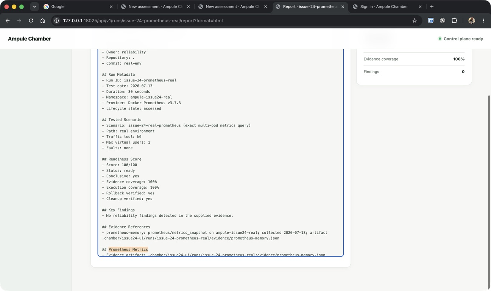
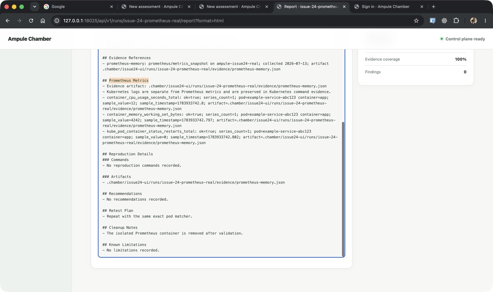

# Issue 24 Prometheus Evidence Verification

Date: 2026-07-13

Host runtime: Docker Desktop 29.5.3

Prometheus runtime: `prom/prometheus:v3.7.3`

The roadmap phase directories named in `AGENTS.md` are not present on the
current `main` branch, so this issue-specific note records the required
acceptance evidence without inventing a phase plan location.

## Real Prometheus query validation

An isolated Prometheus container scraped three target metrics from a local
fixture. The test did not use or mutate the existing kind clusters.

```bash
uv run python -m http.server 18024 \
  --directory /tmp/ampule-issue24-prometheus --bind 0.0.0.0

docker run --rm -d \
  --name ampule-issue24-prometheus-20260713 \
  -p 19024:9090 \
  -v /tmp/ampule-issue24-prometheus/prometheus.yml:/etc/prometheus/prometheus.yml:ro \
  prom/prometheus:v3.7.3 \
  --config.file=/etc/prometheus/prometheus.yml

uv run python -c 'from pathlib import Path; from chamber.workflow import \
_collect_prometheus_memory_evidence; _collect_prometheus_memory_evidence(\
Path(".chamber/verification/issue-24-real"), \
prometheus_url="http://127.0.0.1:19024", \
namespace="ampule-issue24-real", pod_names=("example-service-abc123", \
"example-service-def456"))'
```

Prometheus reported the scrape target `health: up`. The generated artifact at
`.chamber/verification/issue-24-real/evidence/prometheus-memory.json` recorded:

- all three required queries with `ok: true`, `error: null`, and
  `series_count: 1`;
- the exact multi-pod matcher
  `pod=~"example-service-abc123|example-service-def456"`, with no invalid
  `\-` escape;
- pod `example-service-abc123`, container `app`, and sampled values and
  timestamps for memory, CPU, and restart signals.

## Computer Use UI validation

The control plane served the generated real-environment report from
`http://127.0.0.1:18025/api/v1/runs/issue-24-prometheus-real/report?format=html`.
Computer Use opened the report in Chrome, navigated to the Prometheus Metrics
section, and verified that HTML exposed the same three successful signals,
labels, values, timestamps, artifact references, and the Kubernetes-log
distinction rendered in Markdown.



The detailed capture keeps all three sampled signals and their artifact paths
visible:



The UI run artifact remains under
`.chamber/issue24-ui/runs/issue-24-prometheus-real/` for local review. The
isolated HTTP server and Prometheus container were stopped after evidence was
captured.
